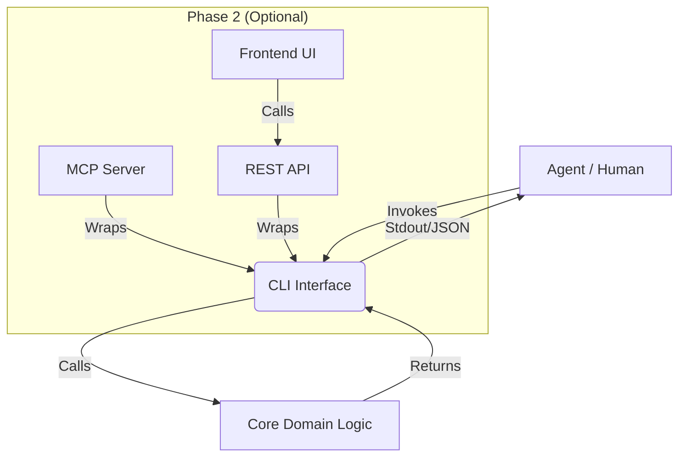

# Agent-CLI-First Development

## Overview

**The CLI is the Agent's API.**

We moved from "Mobile First" to "AI First." In this era, the primary interface for your logic is no longer a human tapping on glass, but an agent invoking a command.

**Core Philosophy:**
1.  **Friction is the Enemy:** Browsers, intricate UI states, and network latency slow agents down.
2.  **Text is King:** Agents thrive on structured text (`stdout`/`stderr`) and deterministic inputs (flags/args).
3.  **Inference Speed:** Development loops should run as fast as the model can think.

**The Golden Rule:**
If an agent can run your feature via a terminal command, it can **test** it, **debug** it, and **iterate** on it without your help. The UI is just a view layer over this proven core.

## When to Use

**ALWAYS start here for:**
- **Greenfield Projects:** Don't start with `create-next-app`. Start with a binary.
- **Business Logic:** Any complex calculation or data transformation.
- **Integrations:** Before building the webhook handler, build the CLI that triggers the logic.
- **Refactoring:** Isolate the messy code into a clean CLI command before rewriting it.

**The Architecture:**



## The Workflow: Spec -> TDD -> Code

Do not write implementation code until the agent can fail at running the command.

### 1. Spec by Hallucination (The Help Text)
The `--help` output IS your design document. It defines the interface contract.

```bash
# SCRIPT: "Imagine the help text for the user management feature"
$ my-app users create --help
Usage: my-app users create [options] <email>

Options:
  --role <admin|editor>  User role (default: editor)
  --json                 Output user object as JSON
```

### 2. TDD: The Iron Law
Write a test that invokes the CLI. It MUST fail because the command doesn't exist yet.

```typescript
// tests/cli/users.test.ts
import { exec } from 'child_process';
import { promisify } from 'util';
const execAsync = promisify(exec);

test('creates a user and returns json', async () => {
    // 1. Arrange & Act
    const { stdout } = await execAsync('./bin/my-app users create test@example.com --role admin --json');
    
    // 2. Assert (Agent can parse JSON easily)
    const user = JSON.parse(stdout);
    expect(user.email).toBe('test@example.com');
    expect(user.role).toBe('admin');
    expect(user.id).toBeDefined();
});
```

### 3. Implementation Loop
The agent is now self-sufficient. It runs the test, sees `command not found` or `unexpected token`, and fixes it.

**Cycle:**
1.  Run Test -> Fail (Red)
2.  Implement CLI parsing -> Fail (Logic missing)
3.  Implement Domain Logic -> Pass (Green)
4.  Refactor -> Pass (Green)

## Red Flags - STOP and Redirect

If you find yourself doing these things, you are drifting:

*   **Flag:** "I'll just add a React form to test if the API works."
    *   **Reality:** You are adding UI complexity to debug logic complexity. You now have two problems.
    *   **Fix:** Write a CLI command that hits the API or calls the function directly.
*   **Flag:** "I need to open the browser to see the result."
    *   **Reality:** The agent cannot "see" the result easily. It has to take screenshots.
    *   **Fix:** Output structured data (JSON) to stdout.
*   **Flag:** "The command requires an interactive prompt."
    *   **Reality:** Interactive prompts block automation.
    *   **Fix:** ALWAYS support flag equivalents (e.g., `--yes`, `--password <env>`).

## Common Rationalizations (And Why They Are Wrong)

| Excuse | Reality |
| :--- | :--- |
| "It's a visual app, I need UI." | Visuals are state. Logic is data. Test the data flow first. The UI can be verified later. |
| "CLI parsing is boilerplate." | Modern tools (`yargs`, `commander`, `clap`) make it trivial. Agents generate this boilerplate in seconds. |
| "I'll add the CLI later." | You won't. The logic will be coupled to the React Component and untestable. |
| "This is just for me." | You are working with an AI pair programmer. You are building *for the agent* as much as for yourself. |

## The "Agent-Ready" Checklist

Your CLI is ready for an agent when:
- [ ] **Help is Truth:** `--help` accurately reflects available options.
- [ ] **Zero Interaction:** Can run fully non-interactively (flags/env vars).
- [ ] **Structured Output:** Supports `--json` for easy parsing by tests/agents.
- [ ] **Exit Codes:** Returns `0` for success, non-zero for failure (so agents stop on error).
- [ ] **Idempotency:** Re-running the command (mostly) doesn't break things.

## Related Skills
- **Required:** `test-driven-development` (The methodology)
- **Recommended:** `create-cli` (The design patterns)
