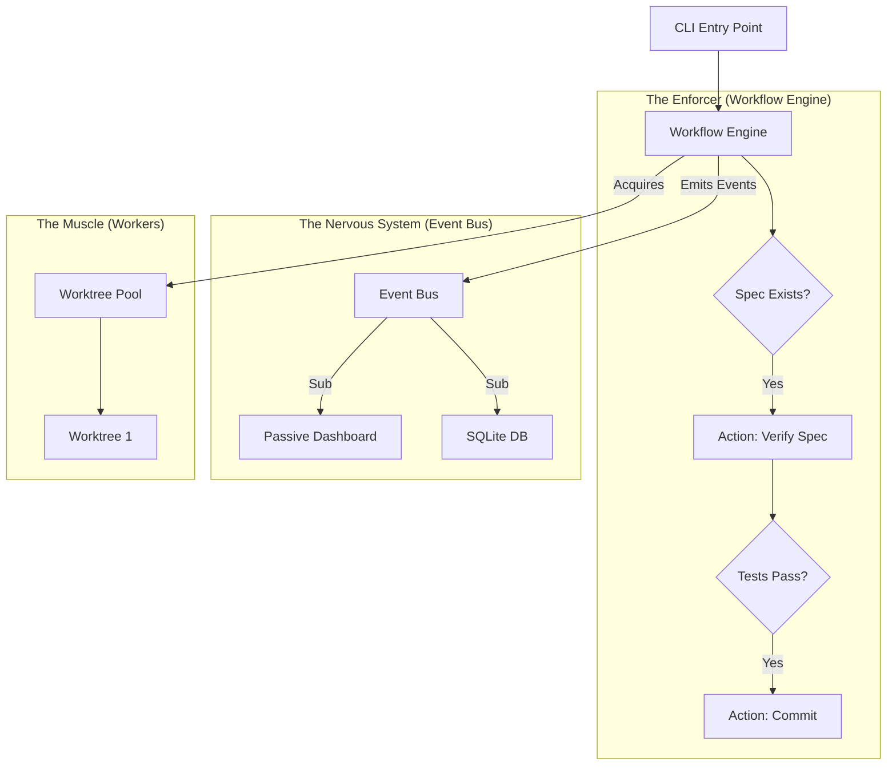

# Hypergrowth Development: The Agentic Console System (v2)

> **Status**: Approved Plan
> **Focus**: Correctness First, Speed Second.
> **Core Principle**: "Disciplined Hypergrowth" via Enforced Workflow Gates.

## 1. Architecture: The Corrected Flow

We correct the previous inversion of control. The TUI is a **passive observer**. The `WorkflowEngine` is the **active enforcer**.



## 2. Core Components Specification

### 2.1. Workflow Engine & Gates
The engine executes a sequence of steps, but each step is protected by a **Gate**.

```typescript
// src/core/workflow/types.ts
export interface WorkflowContext {
  traceId: string;
  command: string;
  args: Record<string, unknown>;
  cwd: string;
  worktree?: string;
}

export interface Gate {
  id: string;
  description: string;
  check(ctx: WorkflowContext): Promise<GateResult>;
}

export type GateResult = 
  | { ok: true }
  | { ok: false, reason: string, suggestions?: string[] };

export interface WorkflowStep {
  id: string;
  gate: Gate;
  action: (ctx: WorkflowContext) => Promise<StepResult>;
}
```

### 2.2. Canonical Event Schema
We replace ad-hoc logging with a strictly typed event schema.

```typescript
// src/core/events/schema.ts
export type NOOAEvent =
  // Workflow Lifecycle
  | { type: 'workflow.started', traceId: string, goal: string }
  | { type: 'workflow.step.start', traceId: string, stepId: string }
  | { type: 'workflow.gate.pass', traceId: string, gateId: string }
  | { type: 'workflow.gate.fail', traceId: string, gateId: string, reason: string }
  | { type: 'workflow.completed', traceId: string, result: 'success' | 'failure' }
  
  // Execution Events
  | { type: 'act.started', traceId: string, goal: string }
  | { type: 'test.failed', traceId: string, test: string, error: string }
  | { type: 'commit.created', traceId: string, hash: string, message: string }
  
  // Resource Events
  | { type: 'worktree.acquired', traceId: string, path: string, branch: string }
  | { type: 'worktree.released', traceId: string, path: string };
```

### 2.3. Worktree Pool Manager
Managed isolation to prevent resource exhaustion and deadlocks.

```typescript
// src/core/worktree/Pool.ts
interface PoolConfig {
  maxWorktrees: number;        // Default: 5
  idleTimeout: number;          // ms, Default: 5min
  cleanupInterval: number;      // ms, Default: 1min
}

class WorktreePool {
  async acquire(branch: string, timeout = 30000): Promise<WorktreeHandle> {
    // Implement Promise.race for timeout
    // Check maxWorktrees limit
  }
  
  async cleanup(): Promise<void> {
    // Remove idle worktrees
    // Prune stale git branches
  }
}
```

## 3. Workflows

### A. The "Disciplined Loop" (Enforced via Code)
This is not just documentation. It is the implementation of `WorkflowEngine.run()`.

1.  **Gate: SpecGate**
    - **Check**: `fs.exists(docs/features/${cmd}.md)` AND `nooa ${cmd} --help` runs.
    - **Action**: Load context.
2.  **Gate: TestGate**
    - **Check**: `bun test` passes.
    - **Action**: Implementation loop.
3.  **Gate: DogfoodGate**
    - **Check**: Command executes successfully in a distinct process.
    - **Action**: User notification.

## 4. Execution Roadmap

### Phase 1: Foundation Repairs (Est: 1 week)
**Goal**: Make the current system reliable enough to build upon.
- [ ] **EventBus Resurrection**: Unskip all 5 tests. Achieve 100% coverage.
    - *Risk Mitigation*: Check for race conditions, use `describe.sequential`.
- [ ] **Event Schema**: Define `src/core/events/schema.ts`.
- [ ] **Instrumentation**: Add `eventBus.emit` to `Act`, `Check`, `Fix`.
    - *Constraint*: Emit events *after* main logic to avoid breaking stdout contracts.
- [ ] **Worktree Pool MVP**: Basic `acquire`/`release` with deadlock protection (timeouts).

### Phase 2: Workflow Engine (Est: 2 weeks)
**Goal**: The "Enforcer".
- [ ] **Gates API**: Implement `Gate` interface.
- [ ] **SpecGate**: First concrete gate implementation.
- [ ] **Engine Logic**: The runner loop.
- [ ] **Integration**: `nooa act` uses `Engine` + `SpecGate`.

### Phase 3: TUI Observer (Est: 1 week)
**Goal**: Visibility.
- [ ] **Read-Only Mode**: `nooa tui --tail` reading from `telemetry.db` / EventBus.
- [ ] **Visuals**: Show TraceID, Step, and Gate status.

### Phase 4: Parallelism (Est: 2 weeks)
**Goal**: Scale.
- [ ] **Parallel Dispatch**: `nooa run --parallel` spawning multiple workers.

## 5. Success Metrics (DoD)
- **Reliability**: 0 skipped tests. `EventBus` works 100% of the time.
- **Enforcement**: Impossible to run `nooa fix` without Spec verification (Engine rejects it).
- **Observability**: `nooa tui` shows distinct "Gate passed/failed" events.

---
**Next Immediate Action**: Start Phase 1. Resurrect EventBus.

## 6. Revisão v2 (Sugestões Incorporadas)

### 6.1. WorkflowEngine: Especificação Formal
Definir contrato explícito para gates e steps antes de implementar:

```ts
export interface WorkflowContext {
  traceId: string;
  command: string;
  args: Record<string, unknown>;
  cwd: string;
  worktree?: string;
}

export type GateResult =
  | { ok: true }
  | { ok: false; reason: string; suggestions?: string[] };

export interface Gate {
  id: string;
  description: string;
  check(ctx: WorkflowContext): Promise<GateResult>;
}

export interface WorkflowStep {
  id: string;
  gate: Gate;
  action: (ctx: WorkflowContext) => Promise<unknown>;
}
```

### 6.2. Event Schema Exaustivo (Sem `| ...`)
Definir eventos de forma fechada e tipada:

```ts
export type NOOAEvent =
  | { type: "workflow.started"; traceId: string; goal: string }
  | { type: "workflow.step.start"; traceId: string; stepId: string }
  | { type: "workflow.gate.pass"; traceId: string; gateId: string }
  | { type: "workflow.gate.fail"; traceId: string; gateId: string; reason: string }
  | { type: "workflow.completed"; traceId: string; result: "success" | "failure" }
  | { type: "act.started"; traceId: string; goal: string }
  | { type: "test.failed"; traceId: string; test: string; error: string }
  | { type: "commit.created"; traceId: string; hash: string; message: string }
  | { type: "worktree.acquired"; traceId: string; path: string; branch: string }
  | { type: "worktree.released"; traceId: string; path: string };
```

### 6.3. WorktreePool: Comportamento de Cleanup
Pool deve definir limites e limpeza:

```ts
interface PoolConfig {
  maxWorktrees: number;    // default: 5
  idleTimeout: number;     // default: 5min
  cleanupInterval: number; // default: 1min
}
```

### 6.4. Ordem de Implementação dos Gates
Implementar em ordem crescente de complexidade:
1. `SpecGate`
2. `TestGate`
3. `DogfoodGate`

### 6.5. Especificação de Estados da TUI
Definir state machine simples:

```ts
type TUIState =
  | { mode: "idle" }
  | { mode: "running"; workers: WorkerView[] }
  | { mode: "paused"; reason: string }
  | { mode: "error"; error: string };

interface WorkerView {
  id: string;
  branch: string;
  currentStep?: string;
  lastGate?: { id: string; status: "pass" | "fail" };
}
```

### 6.6. Riscos e Mitigações
- **EventBus**: investigar skips antes de unskip (race conditions).
- **Integração**: emitir eventos após stdout/stderr para não quebrar contratos.
- **WorktreePool**: `acquire()` com timeout para evitar deadlock.

## 7. DoD por Phase (Aceitação)

### Phase 1
- EventBus sem skips
- 3 comandos emitindo eventos
- WorktreePool MVP com `acquire/release/list`

### Phase 2
- `WorkflowContext`, `Gate`, `WorkflowStep` definidos
- `WorkflowEngine` operando com SpecGate/TestGate/DogfoodGate
- `nooa act` usando WorkflowEngine

### Phase 3
- TUI read-only exibindo eventos e gates
- Atualização em tempo real

### Phase 4
- Paralelismo com 2+ workers
- Cleanup automático de worktrees

## 8. Métricas de Sucesso
- **EventBus**: emit < 1ms, sem perda
- **Workflow**: gates detectam spec/test/dogfood falhos
- **TUI**: update < 50ms
- **Parallel**: 5 workers sem deadlock
