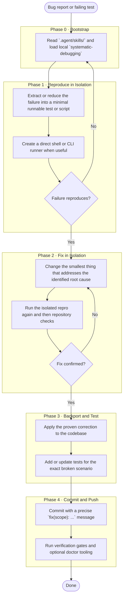

# AI-Assisted Development Workflow for NOOA

> Practical guide for AI-assisted development in this repository. This version is adapted to NOOA's real commands, local skill system, and existing engineering constraints.

---

## Overview

This document defines the canonical workflow for developing features, refactors, and fixes with AI agents inside NOOA.

The objective is not "AI productivity" in the abstract. The objective is a development loop that is:

- fast enough to maintain momentum
- concrete enough to execute for real
- deterministic enough to verify
- strict enough to reject theatrical code

In this repository, that means three things are non-negotiable:

1. **Project-local skills are the source of truth.**
   The workflow starts from `.agent/skills/`, not from a generic global skill registry.
2. **Verification beats plausibility.**
   Code is not done because it looks correct. It is done when it runs, passes checks, and survives direct execution.
3. **The repository's actual operating model matters.**
   NOOA is a Bun + TypeScript + CLI-first system with worktree support, strong emphasis on commands, and an existing self-describing module philosophy. The workflow has to fit that reality.

This document keeps the strategic content of the original guide, but rewrites it in local terms so future sessions can follow one canonical process instead of blending global advice, stale habits, and repo-specific guardrails.

---

## Source of Truth

Inside this repository, the authoritative workflow lives in two places:

- `.agent/skills/`
- this document

The intended relationship is:

- **Skills** are the executable entry points for behavior.
- **This document** is the long-form explanation of why the behavior exists, how the phases connect, and how to adapt the process without losing rigor.

If an older plan, note, or historical document references `superpowers:*` or another global naming scheme, interpret that as historical context, not the current source of truth. The current source of truth is the local skill of the same intent whenever it exists.

Examples:

- historical `superpowers:writing-plans` -> local `.agent/skills/writing-plans`
- historical `superpowers:systematic-debugging` -> local `.agent/skills/systematic-debugging`
- historical `superpowers:using-git-worktrees` -> local `.agent/skills/using-git-worktrees`

This matters because local skills encode repository reality:

- actual commands
- actual conventions
- actual failure modes already discovered here
- actual trade-offs NOOA has chosen

Global skills can still be useful as inspiration, but in this repository they are fallback material, not policy.

---

## Why This Workflow Exists

AI agents are good at local synthesis and weak at sustained correctness across ambiguous, multi-file, multi-step execution unless the environment forces discipline.

In practice, AI failure patterns in software work are repetitive:

- code that looks right but was never executed
- tests that verify the wrong thing
- abstractions added before a stable behavior exists
- plans that sound coherent but omit integration points
- "fixes" that patch symptoms without isolating root cause
- documentation that drifts away from behavior

NOOA already leans toward the right counterweights:

- CLI-first verification
- Bun-based fast feedback
- local skills
- worktree isolation
- documentation as active infrastructure
- self-evolving, self-describing modules

This workflow organizes those pieces into a repeatable sequence so the agent is not improvising process every turn.

---

## The Local Workflow Stack

The workflow is not one giant skill. It is a composition of local skills with different responsibilities.

### Phase drivers

- `.agent/skills/using-superpowers`
- `.agent/skills/brainstorming`
- `.agent/skills/writing-plans`
- `.agent/skills/executing-plans`
- `.agent/skills/subagent-driven-development`

These define how work is framed, broken down, and executed.

### Quality gates

- `.agent/skills/test-driven-development`
- `.agent/skills/systematic-debugging`
- `.agent/skills/dogfooding`
- `.agent/skills/verification-before-completion`
- `.agent/skills/requesting-code-review`
- `.agent/skills/receiving-code-review`

These prevent the most common failure modes: guessing, skipping verification, and claiming success too early.

### Structural guidance

- `.agent/skills/using-git-worktrees`
- `.agent/skills/self-evolving-modules`
- `.agent/skills/refactoring-command-builder`
- `.agent/skills/agent-cli-first`

These align implementation with how NOOA is built: CLI-first, command-oriented, and biased toward self-describing modules.

---

## Full Workflow Diagram

```mermaid
flowchart TD
    DEV(["Developer"]) -->|"sends request to AI"| READ_SKILLS

    subgraph PHASE_0 ["Phase 0 · Bootstrap"]
        READ_SKILLS["AI reads `.agent/skills/` and workspace context"]
        READ_SKILLS --> USE_LOCAL["Load local `using-superpowers`"]
        USE_LOCAL --> BRAINSTORM["Load local `brainstorming` when the work changes behavior or creates something new"]
        BRAINSTORM --> WRITE_PLAN["Load local `writing-plans` when the task becomes multi-step"]
    end

    WRITE_PLAN --> PLAN_READY{Plan concrete enough?}
    PLAN_READY -->|"No"| WRITE_PLAN
    PLAN_READY -->|"Yes"| CROSS_REVIEW

    subgraph PHASE_1 ["Phase 1 · Plan Review"]
        CROSS_REVIEW["Review the plan with a different model when available, or escalate to human review when external model review is unavailable"]
    end

    CROSS_REVIEW --> PLAN_APPROVED{Plan approved?}
    PLAN_APPROVED -->|"Needs changes"| WRITE_PLAN
    PLAN_APPROVED -->|"Approved"| WORKTREE

    subgraph PHASE_2 ["Phase 2 · Workspace Isolation"]
        WORKTREE["Use local `using-git-worktrees` and prefer `.worktrees/<branch>` when isolation is needed"]
    end

    WORKTREE --> RED

    subgraph PHASE_3 ["Phase 3 · TDD Red to Green"]
        RED["Write failing test first"]
        RED --> RUN_RED["Run targeted test and confirm correct failure"]
        RUN_RED --> GREEN["Implement the smallest real behavior that makes it pass"]
        GREEN --> RUN_GREEN["Run tests and repository checks again"]
    end

    RUN_GREEN --> CLI_VERIFY

    subgraph PHASE_4 ["Phase 4 · CLI-First Verification"]
        CLI_VERIFY["Execute what was written directly from the shell or through a generated runner"]
    end

    CLI_VERIFY --> EXECUTE

    subgraph PHASE_5 ["Phase 5 · Continue Execution"]
        EXECUTE["Finish remaining planned tasks with the same red-green-verify loop"]
    end

    EXECUTE --> COMMIT

    subgraph PHASE_6 ["Phase 6 · Commit and Pre-Push"]
        COMMIT["Commit with conventional commit message"]
        COMMIT --> PREFLIGHT["Run local verification gates and optional framework-specific doctoring"]
    end

    PREFLIGHT --> PR

    subgraph PHASE_7 ["Phase 7 · Review"]
        PR["Open PR or integrate through the project's chosen branch flow"]
        PR --> REVIEW["Human or cross-agent code review"]
        REVIEW --> PASS{Pass?}
        PASS -->|"No"| POST_MORTEM["Write post-mortem, improve local skill or plan, restart from Phase 0"]
        PASS -->|"Yes"| DONE(["Done"])
    end

    POST_MORTEM --> WRITE_PLAN
```



---

## Refactoring and Bug Fix Workflow Diagram



---

## Phase 0: Bootstrap

Every session should start by reading the workspace context, then the local skills.

### Required workspace context

At minimum, in a main session:

1. `SOUL.md`
2. `USER.md`
3. `memory/YYYY-MM-DD.md` for today
4. `memory/YYYY-MM-DD.md` for yesterday
5. `MEMORY.md`

This repository already encodes that rule in `AGENTS.md`. The workflow begins there, not at arbitrary code edits.

### Required skill bootstrap

The first local skill to load is:

- `.agent/skills/using-superpowers`

Its function in this repository is simple: do not improvise process when a local skill already exists for the situation.

From there, choose the next local skill based on work type:

- **new feature / behavior change / substantial refactor** -> `brainstorming`
- **multi-step implementation** -> `writing-plans`
- **bug / failing test / unclear behavior** -> `systematic-debugging`
- **new or refactored NOOA command** -> `self-evolving-modules`

### What bootstrap prevents

Bootstrap is not ceremony. It prevents three real problems:

1. **Context loss**
   The agent acts without understanding the user, workspace, or recent decisions.
2. **Process drift**
   The agent defaults to generic habits instead of project-local discipline.
3. **Premature implementation**
   The agent writes code before deciding what should be built and how it will be verified.

---

## Phase 1: Plan Creation and Iteration

When the task is non-trivial, the agent should not jump directly into implementation. It should create a concrete plan.

In NOOA, that means using the local `writing-plans` skill and saving the result under `docs/plans/`.

### What a good plan does

A valid plan in this repository should answer:

- what is being built or changed
- why this approach was chosen
- which exact files are likely to be touched
- what tests will fail first
- how the code will be executed directly
- what verification command proves completion

This is especially important with AI because vague plans tend to create vague code. If the plan cannot name the files, tests, and verification commands, it is usually still hand-wavy.

### Questions that should be asked during plan iteration

Before approving a plan, challenge it with concrete pressure:

- What is the smallest runnable slice?
- What command will the agent execute to prove this is real?
- What fails first in the red phase?
- What exact edge case is easy to forget?
- What part of the design depends on assumptions instead of current repository facts?
- If the feature fails in production, where will the evidence show up?

### Project reality

Not every NOOA task needs a large plan document. A tiny fix may only need a short local reasoning loop. But if the work spans multiple files, behavior changes, test updates, or CLI/documentation coupling, a plan is cheaper than rework.

---

## Phase 1b: Cross-Model Plan Review

The original guide is correct on the core point: a model reviewing its own plan is a weak critique.

### Recommended rule

- Plan by one model family
- Review by another model family
- Limit review loops to 2-3 rounds

### Adaptation to NOOA reality

In some sessions, only one model environment is active. When that happens:

1. Prefer a real second-model review if available.
2. If not available, ask for human review when the task is risky.
3. If neither is available and the task is still proceeding, force the review into artifacts:
   - write the plan down
   - enumerate assumptions
   - enumerate failure modes
   - enumerate verification commands

This is weaker than true cross-model review, but still better than silent self-agreement.

### Why this matters

AI plans often fail not because they contain obvious nonsense, but because they omit one dependency, one migration, one edge case, or one execution path. A second reviewer is useful precisely because omission is hard for the original generator to notice.

---

## Phase 2: Worktree Isolation

When the task is substantial or risky, use a git worktree instead of mixing partial implementation into the current branch.

In NOOA, the local skill for this is:

- `.agent/skills/using-git-worktrees`

### Local preference

Prefer `.worktrees/<branch-name>` when the project already supports it and the directory is ignored correctly.

Example:

```bash
git worktree add .worktrees/feature-ai-workflow -b feature/ai-workflow
```

### Why this phase exists

Worktrees solve real operational problems:

- keep the main workspace readable
- isolate experimental work
- allow parallel feature work
- make it easier to discard or compare approaches
- reduce accidental contamination from unrelated local changes

### Important local nuance

The worktree is not "ready" just because it was created. After creation:

- install dependencies if needed
- verify commands resolve
- run a clean baseline test/check

If the baseline already fails, document that fact before continuing. Otherwise the agent cannot distinguish a pre-existing issue from a regression it introduced.

---

## Phase 3: TDD Red to Green

The local quality discipline is still classic:

1. **RED**: write the failing test first
2. **GREEN**: write the smallest real code that makes it pass
3. **VERIFY**: run the targeted test, then broader checks

In this repository, the local skill to enforce that is:

- `.agent/skills/test-driven-development`

### What RED should look like

The red phase should fail for the right reason:

- missing behavior
- wrong output
- incorrect error handling

It should not fail because:

- the test file is broken
- the fixture is invalid
- the command path is wrong
- the test is asserting a fantasy API

### What GREEN should look like

Green is not license to overbuild. The first green implementation should:

- solve the tested behavior
- remain easy to inspect
- avoid unrelated abstractions
- preserve future refactor space

### Repository-specific verification loop

Typical loop for a local feature or fix:

```bash
bun test path/to/targeted.test.ts
bun test
bun run check
```

If the task affects CLI behavior, add direct execution:

```bash
bun run index.ts <command> --help
bun run index.ts <command> <args>
```

If the task affects a single exported behavior and a direct command is awkward, create a small runner and execute it directly.

---

## Phase 4: CLI-First Verification

This repository is explicitly CLI-first. That is not branding. It is an execution strategy.

The agent must execute what it wrote.

### Preferred verification order in NOOA

#### 1. Direct command execution

Preferred whenever the feature is already exposed through the CLI:

```bash
bun run index.ts <command> <args>
```

or, if the environment has the built command available:

```bash
nooa <command> <args>
```

#### 2. Direct file execution

Useful when validating a module or runner without the full command surface:

```bash
bun run src/path/to/file.ts
```

#### 3. Generated or hand-written minimal runner

Useful when the behavior exists as a function and the CLI surface is not yet the shortest path to proof.

### Why CLI-first matters here

It forces the agent to deal with:

- argument parsing
- real imports
- real runtime behavior
- real stderr/stdout
- actual exit conditions

That eliminates a large class of "works in the abstract" failures.

### Relationship to self-evolving modules

When implementing or refactoring NOOA commands, CLI-first verification should be paired with:

- `.agent/skills/self-evolving-modules`

The goal is not only to make the command work. The goal is to make the command self-describing so help text, agent docs, examples, and implementation stay aligned.

---

## Phase 5: Continue Executing the Plan

Once the first slice is working, continue through the remaining tasks without abandoning the loop.

For each task:

1. confirm the next smallest slice
2. write or adjust the failing test
3. implement the smallest real behavior
4. run targeted verification
5. run broader verification when the task boundary is complete

If the plan is being executed in a structured session, the relevant local skill is usually one of:

- `.agent/skills/executing-plans`
- `.agent/skills/subagent-driven-development`

The principle is the same either way: do not collapse the whole plan into one giant edit and one giant test run at the end.

---

## Phase 6: Commit and Pre-Push Checks

When the implementation is complete, commit with a conventional message that says what changed.

Examples:

```bash
git commit -m "docs(workflow): add local AI-assisted development guide"
git commit -m "feat(skills): add local AI workflow skill"
git commit -m "fix(commit): preserve staged file ordering"
```

### Pre-push checks in NOOA

At minimum, the agent should run the repository verification commands relevant to the change.

Common defaults:

```bash
bun test
bun run check
```

If the change is CLI-facing, dogfood the relevant command(s):

```bash
bun run index.ts --help
bun run index.ts <command> --help
```

### Optional framework doctoring

The original guide recommends `framework-doctor`. That still makes sense as an optional gate, especially for framework-heavy surfaces.

Example:

```bash
npx -y @framework-doctor/cli .
```

In NOOA, this should be treated as an additional health check, not a replacement for the repository's own checks.

---

## Phase 7: Pull Request and Review

The integration path may vary by branch strategy, but the review logic stays the same:

- a human should be able to inspect the change clearly
- the rationale should be visible
- the verification evidence should be reproducible

### What the review is looking for

- Does the code run, or only read well?
- Did the agent verify the real command path?
- Are there any `TODO`, mock leaks, fake implementations, or narrative placeholders?
- Are tests covering the broken or changed behavior, or only the happy path?
- Did documentation drift from implementation?
- Did the agent claim success with evidence, or with confidence language?

### Local code review support

When preparing or responding to review, use the local skills:

- `.agent/skills/requesting-code-review`
- `.agent/skills/receiving-code-review`

These should be treated as process skills, not cosmetic steps.

---

## Post-Mortem and Workflow Improvement

When a task goes wrong badly enough that patching the result is more expensive than restarting, the correct response is not denial. It is a post-mortem.

### When to trigger a post-mortem

- repeated failed fixes
- large review rejection because the work is theatrical
- drift between docs and behavior
- skipped verification causing rework
- vague plan leading to ambiguous implementation

### What to record

- what was underspecified
- which assumption was false
- which verification gate was missing or ignored
- whether a local skill should be updated
- whether a new local skill is warranted

This is how the repository gets better over time. The fix is not only in code. The fix is also in the process artifact that failed to guide future sessions.

---

## Architecture Philosophy for Agent-Driven Development

Agent-driven development changes the practical bottleneck. The issue is not just whether the architecture is elegant. The issue is whether the architecture remains navigable and verifiable for an AI operating under finite context.

### What tends to break AI performance

Code becomes harder for agents when behavior depends on:

- deep abstraction stacks
- indirection without strong payoff
- many files to trace one simple path
- hidden contracts
- coupled state transitions across distant modules

In those situations, the model starts approximating. That is where theatrical code comes from.

### The NOOA bias

For most repository work, prefer:

- flat over ceremonially layered
- explicit over abstract
- colocated over scattered
- direct over indirect
- command-visible behavior over invisible magic

This does **not** mean "be sloppy." It means put correctness pressure into:

- tests
- type checking
- lint/check
- direct execution
- telemetry
- self-describing command surfaces

### When heavier architecture is still justified

Heavier structure can still make sense when:

- failure impact is very high
- boundaries truly need enforcement
- multiple implementations are real, not hypothetical
- the team will actually maintain the abstraction

But in routine AI-assisted development, every extra layer creates navigation cost. If the layer does not buy a real operational property, it usually hurts more than it helps.

---

## Deterministic Tooling as the Quality Net

What actually guarantees quality here is not architectural rhetoric. It is deterministic evidence.

### Quality tools and what they prove

| Tool | What it proves in practice |
|---|---|
| Targeted tests | The specific changed behavior works |
| Full test suite | The repository still behaves coherently overall |
| `bun run check` | Static constraints and repository checks still hold |
| Direct CLI execution | The path a user or agent will actually run works |
| Type information | Compile-time contracts remain intact |
| Telemetry/observability | Runtime failures can be traced after shipping |
| Self-describing command metadata | Help/docs/examples drift is reduced |

The broader lesson is simple: the more a claim depends on runtime reality, the more the agent should prove it with execution instead of prose.

---

## Bug Fix and Refactor Guidance

The original guide distinguishes new feature flow from bug-fix flow. That distinction is useful and should remain.

### For bug fixes

Use:

- `.agent/skills/systematic-debugging`

before proposing or applying fixes.

The rule is root cause before patching.

### For refactors

Treat refactors as behavior-preserving changes until proven otherwise.

That means:

- keep a runnable baseline
- preserve tests before broad movement
- verify outputs before and after
- do not merge speculative cleanup with behavioral changes unless there is a strong reason

### For command refactors

Use:

- `.agent/skills/self-evolving-modules`
- `.agent/skills/refactoring-command-builder`

when the refactor touches NOOA's CLI surfaces, generated docs, or command metadata.

---

## Memory Files and Guardrails

Some workflow failures are not one-off mistakes. They are recurring AI anti-patterns. Those should become guardrails.

Examples of red-flag patterns:

- `TODO` in production behavior
- mock logic escaping into runtime code
- "in a real implementation" comments
- unjustified `any`
- `eval` or `new Function()` without a very strong reason
- completion claims without fresh verification

When a pattern repeats, the right response is not only to fix the instance. It is also to improve:

- `AGENTS.md`
- a local skill
- a plan template
- a verification checklist
- memory files, when the lesson is durable

This is how the workflow stays alive instead of becoming stale documentation.

---

## Why MCP Is Not the Core of This Loop

For code generation and verification, the repository should remain CLI-first.

That is not a rejection of MCP in general. It is a sequencing rule.

### CLI-first advantages in the generation loop

- lower latency
- fewer moving parts
- easier repeatability
- easier scripting
- more deterministic debugging
- less interruption from tool reconnects or external context reloads

### Where MCP still makes sense

Outside the immediate code-write-run loop:

- documentation lookup
- browser inspection
- external system queries
- tasks where the agent is consuming external context rather than validating freshly written code

The rule is straightforward: do not let remote tooling replace direct local proof of behavior.

---

## Canonical Local Phase Mapping

The original workflow can be translated into the local NOOA stack like this:

| Phase | Local skill(s) or mechanism |
|---|---|
| Bootstrap | `using-superpowers`, workspace files, `.agent/skills/` |
| Feature design | `brainstorming` |
| Multi-step implementation planning | `writing-plans` |
| Alternate model review | external model or human review |
| Workspace isolation | `using-git-worktrees` |
| TDD | `test-driven-development` |
| Root-cause debugging | `systematic-debugging` |
| CLI-first execution | `agent-cli-first`, direct Bun/NOOA commands |
| Real-world command verification | `dogfooding` |
| Completion claims | `verification-before-completion` |
| Command architecture discipline | `self-evolving-modules` |
| Review loop | `requesting-code-review`, `receiving-code-review` |
| Branch completion | `finishing-a-development-branch` |

This mapping is important because it lets future agents translate high-level process language into the local vocabulary already present in the repository.

---

## Recommended Default Loops

### Feature loop

1. Read workspace context.
2. Load local `using-superpowers`.
3. Load local `brainstorming`.
4. Write plan if task is multi-step.
5. Use worktree when the task is substantial.
6. TDD red to green.
7. Execute the resulting behavior directly.
8. Run broader repository checks.
9. Dogfood CLI behavior if applicable.
10. Verify before claiming completion.
11. Commit and review.

### Bug-fix loop

1. Read workspace context.
2. Load local `systematic-debugging`.
3. Reproduce the failure.
4. Isolate the failure.
5. Form a single root-cause hypothesis.
6. Validate the hypothesis with the smallest fix.
7. Backport to real code.
8. Add or update tests for the broken scenario.
9. Run direct execution plus repository checks.
10. Verify before claiming completion.

### Command-development loop

1. Read workspace context.
2. Load local `self-evolving-modules`.
3. Define or update the command contract.
4. Write failing tests.
5. Implement the smallest real command behavior.
6. Verify help text, parsing, and runtime execution.
7. Ensure generated/derived docs stay aligned.
8. Run repository checks.
9. Dogfood the command.
10. Verify before claiming completion.

---

## Bottom Line

The local standard for AI-assisted development in NOOA is:

- start from `.agent/skills`
- think before editing
- isolate substantial work
- test before trusting
- execute before claiming
- improve the workflow when it fails

The purpose of this workflow is not to slow development down. It is to remove fake speed: the kind that comes from writing plausible code quickly and then paying for it in review churn, debugging thrash, and silent drift.

In this repository, real speed comes from disciplined loops with local guardrails.
